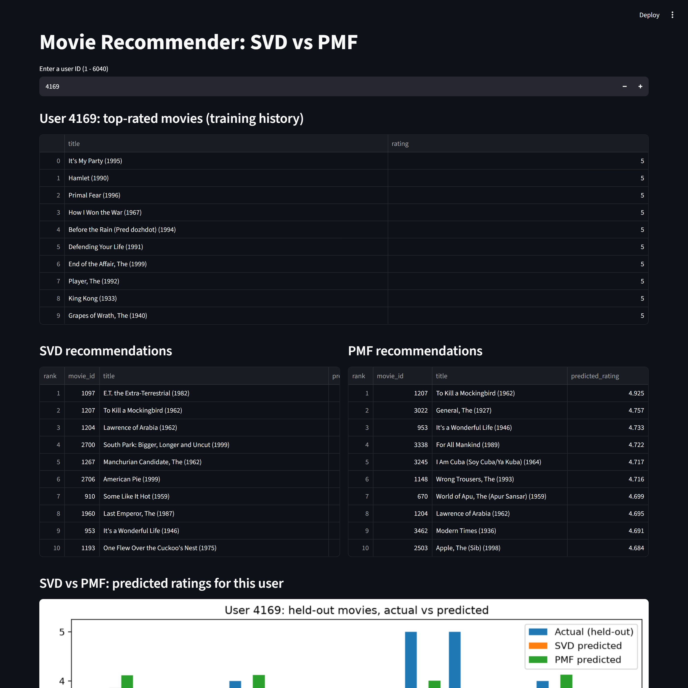
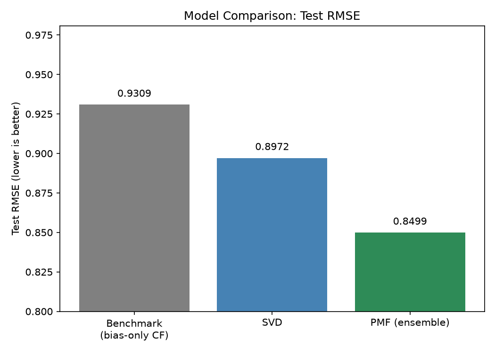
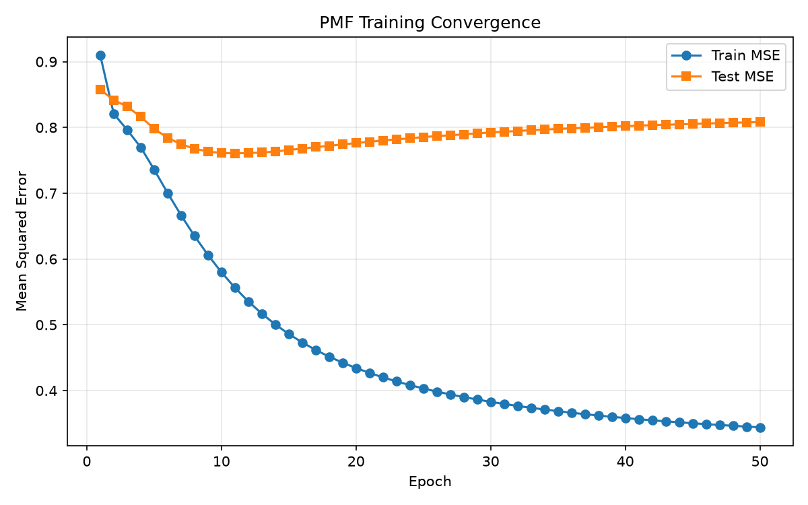
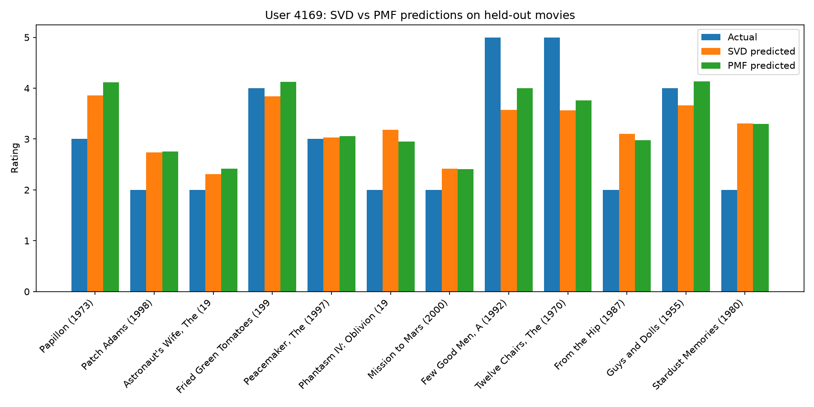

# Movie Recommender System - SVD vs PMF

A movie recommender system trained on **1 million ratings** (MovieLens 1M), built from scratch with numpy/scipy - no recommender libraries. Two matrix factorization models are implemented, tuned, and compared head-to-head, served through an interactive **Streamlit dashboard**.

> **TL;DR:** PMF (mini-batch SGD ensemble, implemented from scratch) beats truncated SVD by **5.3%** and a collaborative-filtering baseline by **8.7%** on held-out test RMSE.



## Results

| Model | Test RMSE | Notes |
|---|---|---|
| Bias-only CF benchmark | 0.9309 | global mean + damped user/item biases |
| SVD (truncated, k=30) | 0.8972 | `scipy.sparse.linalg.svds` over baseline residuals |
| **PMF (SGD ensemble)** | **0.8499** | k=128, L2 reg, 6-seed average |

Evaluated on a held-out 20% test split (`random_state=42`, fully reproducible). The user–item matrix is **95.5% empty** - predicting the blanks from sparse signals is the whole game.



## Highlights

- **PMF implemented from scratch** with vectorized mini-batch SGD (`np.add.at` gradient scatter) - trains 6 models × 65 epochs on 800K ratings in minutes, no ML framework needed.
- **Proper methodology:** train/test split *before* matrix construction (no data leakage), hyperparameters chosen on a 5% validation carve-out, epoch budget justified by learning curves, final model retrained on the full training set.
- **Overfitting controlled** via L2 regularization (MAP view of PMF's Gaussian priors), learning-rate decay, and validation-based stopping - see the train/test curves:



- **Ensemble trick:** averaging 6 PMF models trained from different random initializations cuts test RMSE by ~0.005 (variance reduction) at zero risk of overfitting.
- **Interpretability, not just metrics:** the notebook analyzes what the latent factors encode and probes the learned space - e.g. nearest neighbours of *Toy Story* in latent space are *Toy Story 2*, *A Bug's Life*, *Aladdin* - the model discovers "animated family film" without ever seeing a genre label.
- **Per-user error analysis** for three user archetypes (power user, casual user, inconsistent rater), explaining *why* accuracy differs between them.



## How it works

1. **Data:** MovieLens 1M ratings are loaded, cleaned, and split 80/20 (`random_state=42`). The user–item matrix (6040 × 3683) is built from training data only and mean-centered per user (`processed/user_item_matrix.csv`).
2. **SVD:** damped user/item biases are estimated first; truncated SVD (`scipy.sparse.linalg.svds`) factorizes only the *residual* taste signal. k tuned over {10, 20, 30, 50}.
3. **PMF:** ratings modeled as `μ + b_u + b_i + U·V`; U, V learned by mini-batch SGD on observed ratings only (missing entries are never treated as zeros - the key advantage over SVD). The final predictor averages 6 seeds.
4. **Evaluation:** RMSE on held-out ratings, benchmarked against a bias-only CF model; predicted-vs-actual and per-user comparison plots in `reports/`.
5. **Serving:** a Streamlit app takes a user ID and returns their top-rated history, top-10 recommendations from both models (excluding already-seen movies), and an actual-vs-predicted comparison chart. Invalid IDs are handled gracefully.

## Quickstart

```bash
pip install -r requirements.txt

# get the data (not committed): https://files.grouplens.org/datasets/movielens/ml-1m.zip
# put ratings.dat, users.dat, movies.dat into data/

python generate_reports.py     # trains both models + writes all metrics/plots (~15-25 min)
python make_notebook.py        # builds the analysis notebook
streamlit run app.py           # launch the dashboard
```

## Project structure

```
├── app.py                        # Streamlit dashboard
├── generate_reports.py          # one-command reproduction of all results
├── models/
│   ├── svd_model.py              # truncated SVD with baseline biases
│   └── pmf_model.py              # PMF + ensemble (mini-batch SGD, from scratch)
├── utils/
│   ├── data_loader.py            # loading, cleaning, reproducible split
│   ├── matrix_creation.py        # user-item matrix + normalization
│   └── recommendation.py         # top-N recommendation generation
├── Movie_Recommender_System.ipynb  # EDA, learning curves, interpretability
└── reports/                      # metrics JSON, plots, per-user recommendations
```

## Tech stack

`Python` · `numpy` · `pandas` · `scipy` · `scikit-learn` · `matplotlib` · `Streamlit`

## What I'd do next

- Implicit-feedback factors (SVD++) and temporal dynamics for a further RMSE push
- Approximate nearest-neighbour retrieval (FAISS) for sub-millisecond serving at scale
- Ranking-oriented evaluation (precision@k, NDCG) alongside RMSE